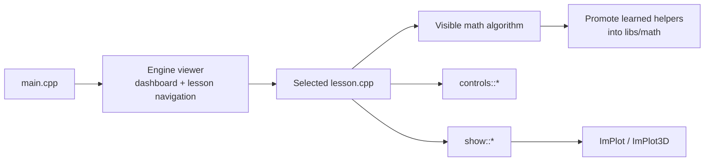

# SLM Learning Lab


https://github.com/user-attachments/assets/8b31db69-c7bf-4349-9faf-739dfeca5c5d


This repository is a syllabus for learning how to build a small language model
from scratch. Each lesson keeps its mathematical algorithm visible and connects
the computed values to reusable controls and visualizations.

The project has a deliberately small mental model:

```text
lessons/    = learn and experiment with an algorithm
libs/math/  = reuse algorithms after they have been learned
libs/engine = edit values and visualize results
main.cpp    = launch the learning viewer
```

## Project structure

```text
slm/
├── CMakeLists.txt
├── CMakePresets.json
├── Makefile
├── vcpkg.json
├── main.cpp
├── cmake/
│   ├── bootstrap-vcpkg.cmake
│   ├── new-lesson.cmake
│   └── templates/
│       └── lesson-blank.cpp.in
├── libs/
│   ├── math/
│   │   ├── include/slm/math/
│   │   │   ├── matrix.hpp
│   │   │   └── vector.hpp
│   │   └── src/
│   └── engine/
│       ├── include/slm/engine/
│       │   ├── controls.hpp
│       │   ├── lesson.hpp
│       │   ├── show.hpp
│       │   └── viewer.hpp
│       └── src/
└── lessons/
    ├── vectors/                 (planned)
    ├── dot_product/             (planned)
    ├── linear_layer/
    │   ├── README.md
    │   └── lesson.cpp
    ├── activation_functions/    (planned)
    └── loss_functions/          (planned)
```

There is no per-lesson CMake file, visualizer file, registry list, application,
or test target. CMake automatically discovers every file matching
`lessons/*/lesson.cpp`.

## How the viewer scales

`main.cpp` never changes, whether the repository contains one lesson or one
hundred. It only launches `slm::engine::run_viewer()`.

The viewer provides:

- a searchable lesson sidebar;
- collapsible syllabus categories;
- category dashboard cards;
- lesson ordering from the `SLM_LESSON` declaration;
- generated experiment controls on the left;
- matrix, text, 2D, and 3D visualization tabs on the right.



## Build and run

`CMakeLists.txt` is the authoritative, cross-platform build definition.
`CMakePresets.json` stores the shared development configuration. The root
`Makefile` is only a short, optional interface for learners using macOS or
Linux; it contains no compilation rules of its own.

On the first run, the setup step creates an ignored local vcpkg checkout in
`.local/vcpkg`. The cross-platform `cmake/bootstrap-vcpkg.cmake` script reads
the pinned revision directly from `vcpkg.json`, checks it out, and runs the
appropriate `.sh` or `.bat` bootstrap script. CMake then installs the declared
dependencies under the ignored build directory.

Later runs reuse both the package-manager checkout and installed dependencies.
The Makefile also skips the configure command unless the build is new or its
core CMake configuration changed. CMake's generated build system handles later
source changes automatically.

### Short learner workflow

On macOS and Linux, one command sets up, configures, builds, and launches the
viewer:

```sh
make run
```

Later calls keep the same short command but reuse the existing configuration.
Open a lesson directly by ID with:

```sh
make run LESSON=linear_layer
```

Run only the package-manager setup with:

```sh
make setup
```

### Portable CMake workflow

The equivalent workflow without the Makefile works on macOS, Linux, and
Windows:

```sh
cmake -P cmake/bootstrap-vcpkg.cmake
cmake --preset dev
cmake --build --preset dev
```

The first command is needed only when vcpkg has not been set up. After the
configure step, repeated builds need only `cmake --build --preset dev`.
Launch the viewer from the stable `build/bin` output directory:

```sh
# macOS or Linux
./build/bin/slm_lab linear_layer

# Windows PowerShell
.\build\bin\slm_lab.exe linear_layer
```

To use an existing vcpkg installation instead of `.local/vcpkg`, pass the same
path to setup and configure. Choose the path before the first configure, or run
`make clean`/remove `build/` before switching because CMake toolchains belong to
a build directory:

```sh
cmake -DVCPKG_ROOT=/path/to/vcpkg -P cmake/bootstrap-vcpkg.cmake
cmake --preset dev \
  -DCMAKE_TOOLCHAIN_FILE=/path/to/vcpkg/scripts/buildsystems/vcpkg.cmake
cmake --build --preset dev
```

The Makefile shorthand for that case is:

```sh
make run VCPKG_ROOT=/path/to/vcpkg
```

When intentionally upgrading vcpkg dependency recipes, change only
`builtin-baseline` in `vcpkg.json` and rebuild from a clean build directory.
The bootstrap script reads that value, so there is no second revision to keep
in sync.

## Adding a lesson

Generate a compiling lesson skeleton with:

```sh
make lesson my_topic
```

The portable CMake form, including on Windows, is:

```sh
cmake -DLESSON_ID=my_topic -P cmake/new-lesson.cmake
```

The ID must use lowercase `snake_case`. It becomes both the lesson directory
and its stable registration ID. The command creates one source file:

```text
lessons/my_topic/lesson.cpp
```

The title is generated from the ID, while the category and syllabus order use
safe defaults. The `NAME=...` form remains available when setting all metadata
explicitly:

```sh
make lesson \
  NAME=dot_product \
  TITLE="Dot Product" \
  CATEGORY="Linear Algebra" \
  ORDER=20
```

The generated frame keeps the learning sequence visible:

```cpp
SLM_LESSON(my_topic, "My Topic", "Uncategorized", 100) {
    // 1. INPUTS: define adjustable values.
    // 2. MATH: write the new equation and loops explicitly.
    // 3. VISUALIZE: pass computed values to controls::* and show::*.
}
```

The generator refuses invalid IDs, duplicate registrations, and overwrites.
There is still no CMake or registry file to edit: the lesson appears in the
dashboard automatically on the next run.

```sh
make run LESSON=my_topic
```

The scaffolder already uses a named template internally. The current `blank`
template teaches the inputs -> math -> visualization flow. Focused `plot2d` and
`plot3d` templates can be added later after their repeated lesson patterns are
clear, without changing lesson discovery or the viewer.

## Reusable learner helpers

Controls edit ordinary variables owned by the lesson:

```cpp
slm::controls::scalar("Learning rate", learning_rate, 0.0F, 1.0F);
slm::controls::vector("Bias", bias, -5.0F, 5.0F);
slm::controls::matrix("Weights", weights, -2.0F, 2.0F);
slm::controls::choice("Neuron", selected, {"Neuron 0", "Neuron 1"});
slm::controls::toggle("Connect points", connect_points);
```

Visualizations copy the lesson's small educational data and render it in tabs:

```cpp
slm::show::text("Equation", "Y = X * W^T + b");
slm::show::matrix("Inputs X", inputs);
slm::show::plot2d("Activation", x, y);
slm::show::plot3d("Mapping", x, y, z);
```

## Growing the math library

First, write an algorithm directly in its lesson so every loop is visible.
After it is understood and needed again, move it into `libs/math/` and import it
from later lessons.

```text
learn the loop -> visualize it -> promote the helper -> reuse it later
```

For example, a dot-product lesson initially shows the multiplication loop. The
linear-layer lesson can later reuse the promoted `dot_product()` helper. This
keeps each lesson focused on the new idea while the SLM math library grows
incrementally.
